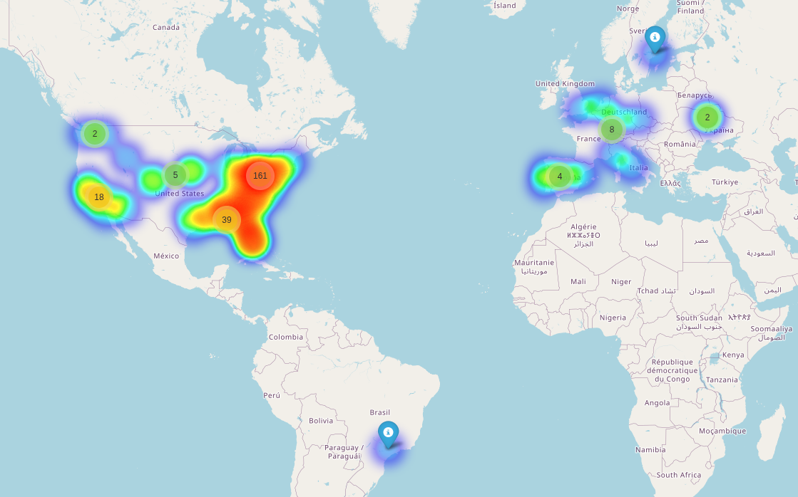

# Tautulli Map

A Python script to visualize Plex server access locations from Tautulli data on an interactive map.



## Setup

1. **Download the code:**
   Open a terminal and run this command to download the project:
   ```bash
   git clone https://github.com/nlitz88/tautulli_map.git
   cd tautulli_map
   ```

2. **Set up virtual environment:**
   ```bash
   python -m venv venv
   source venv/bin/activate  # On Windows: venv\Scripts\activate
   ```

3. **Install dependencies:**
   ```bash
   pip install -r requirements.txt
   ```

4. **Configure credentials** (choose one method):

   **Option A: .env file** (recommended)
   Create a `.env` file in the same directory as the script:
   ```env
   TAUTULLI_URL="http://your-tautulli-server:8181"
   TAUTULLI_API_KEY="your-api-key-here"
   ```

   **Option B: Environment variables**
   ```bash
   export TAUTULLI_URL="http://your-tautulli-server:8181"
   export TAUTULLI_API_KEY="your-api-key-here"
   ```

   **Option C: Edit the script directly**
   Edit the `TAUTULLI_URL` and `TAUTULLI_API_KEY` variables in the script.

## Usage

Run the script:
```bash
python tautulli_map.py
```

Options:
- `--length N`: Number of history records to fetch (0 = all records, default: 0)

Examples:
```bash
# Get all history (default)
python tautulli_map.py

# Get last 1000 records
python tautulli_map.py --length 1000

# Get last 100 records
python tautulli_map.py --length 100
```

The script will:
- Fetch history from Tautulli
- Geocode IP addresses (with caching)
- Generate an interactive map with heatmap and markers
- Save as `plex_map.html`

Open `plex_map.html` in your browser to view the map.

## Features

- Heatmap showing access frequency
- Clustered markers with play counts and IP info
- IP geocoding with caching to avoid repeated API calls
- Skips private IP addresses

## Troubleshooting

- Ensure Tautulli is running and accessible
- Check your API key in Tautulli Settings > Web Interface > API Key
- Verify the TAUTULLI_URL is correct

---

## Disclosure
This project was created with the assistance of Cline, an AI-powered coding assistant.
